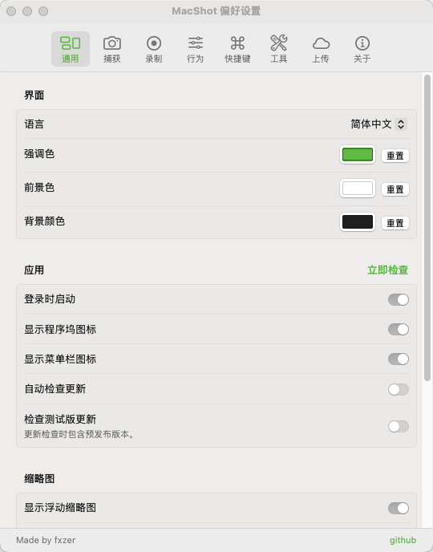

# macshot

  

> 本项目基于 [sw33tLie/macshot](https://github.com/sw33tLie/macshot) 魔改而来

  <b>免费、开源的 macOS 截图与录屏工具</b> 
  原生 Swift + AppKit 开发。无 Electron。无冗余。

  <a href="https://github.com/fxzer/macshot/releases/latest">下载</a> · <a href="https://github.com/fxzer/macshot/blob/main/CHANGELOG.md">更新日志</a> · <a href="https://github.com/fxzer/macshot/blob/main/PRIVACY.md">隐私政策</a>

  

  

---

### 主要改动

#### 🎨 UI 与视觉打磨
- **偏好设置重构** — 重新组织设置项分组，通用、工具、录制三大标签页，布局更清晰
- **前景色统一** — 将"图标颜色"重命名为"前景色"，侧边调色 Popover、上传确认文本等跟随该设置
- **缩略图 UI 适配** — 调整缩略图大小时，内部操作按钮等比缩放，不再被遮挡
- **窗口吸附高亮** — 标注框颜色跟随 macOS 系统偏好设置的"强调色"
- **选区尺寸吸附** — 调整选区尺寸时自动吸附到50/100像素整数倍
- **缩放动画** — 编辑窗口修改缩放比例时加入平滑过渡动画

#### 🚀 交互体验
- **Snipaste 式自由拖拽** — 框选后鼠标移入选区内即可拖动整个区域，无需按住移动按钮；再次点击工具图标可取消激活
- **智能文本输入框**
  - 插入时宽度随内容自动撑开
  - 输入完成后支持拖拽右下角手柄等比例缩放文字及边框
  - 鼠标移至文本框边缘时光标变为可拖拽形态，支持直接移动
  - 支持拖拽左右边框居中手柄，手动调整固定宽度
- **选区控制增强**
  - 支持鼠标滚轮缩放调整选中元素大小(类似：Snipaste，画笔、箭头等...)
  - 可自定义比例锁定，数字键 0-9 锁定选区比例（0=自由，1=1:1，2=2:3 等，比例支持输入小数格式），R 键反转比例
- **快捷取色** — 捕获阶段按 C 复制颜色，Shift 切换 RGB/HEX 格式
- **高级放大镜** — 支持点击插入或拖拽指向某处，拉出放大区域而不遮挡原信息
- **历史面板键盘流** — 打开面板默认聚焦第一项，方向键切换，回车复制到剪贴板或展开快捷操作
- **提示信息优化** — 提示移至左下角，补充快捷键提示（拖拽/比例锁定/F 全屏/Tab 窗口吸附/R 反转比例/数字键锁定）
- **截图音效优化** — 仅在特定成功节点播放（缩略图固定、历史面板回车等）

#### 🛠️ 功能新增
- **自定义与预设比例截图** — 内置常用比例（3:4、4:3、16:9 等），支持自定义输入
- **Emoji 分组面板** — 表情选择器支持分组显示，快速查找
- **文件名格式自定义** — 支持如 `MacShot_2026-04-13_15-30-00.png` 格式的文件名
- **比例锁定快捷键** — 选区阶段数字键 0-9 快速锁定常用比例
- **新增色盘** -框选后或编辑器内，鼠标右键可快速设置预制色值
- **上传前确认** — 右键上传选项显示确认提示
- **记住上次选区** — 下次截图快速恢复上次选择区域

#### ⚙️ 架构优化
- **精简语言** — 移除大量国际化文件，仅保留中英文
- **性能优化** — 重构架构，拆分大文件，清理死代码，优化渲染和响应性能
- **必应翻译集成** — 研究并接入 Bing 翻译引擎 API
- **Google OAuth** — 集成 Client ID 授权参数

---

## 安装

从 [Releases](https://github.com/fxzer/macshot/releases) 下载最新的 `.dmg` 文件，打开后拖拽到 `/Applications`。

---

## 快速开始

1. 启动 macshot — 它会出现在菜单栏中
2. 按 `Cmd+Shift+X` 进行截图
3. 拖动选择区域，使用工具栏标注，按 `Cmd+C` 复制
4. 按 `Esc` 取消

---

## Raycast / Alfred / 自动化

macshot 注册了 `macshot://` URL scheme，因此 **Raycast**、**Alfred** 和 **快捷指令** 等启动器可以直接触发截图操作。

Raycast Quicklinks 推荐命令：

- `macshot://capture-area` — 截取区域
- `macshot://capture-fullscreen` — 截取全屏
- `macshot://quick-capture` — 快速截图
- `macshot://ocr` — OCR 文字识别
- `macshot://record-area` — 录制区域
- `macshot://record-fullscreen` — 录制全屏
- `macshot://scroll-capture` — 滚动截图
- `macshot://history` — 历史记录
- `macshot://settings` — 偏好设置
- `macshot://stop-recording` — 停止录制
- `macshot://open?file=/absolute/path/to/image.png` — 打开指定图片

兼容性别名如 `macshot://capture` 和 `macshot://record` 仍然有效。如果安装或更新后 Raycast 未显示 MacShot，请将应用移动到 `/Applications` 并等待 macOS 完成重新索引。

---

<b>所有功能</b>

### 截图功能
- **即时截图** — 全局热键冻结屏幕，选择任意区域
- **窗口吸附** — 鼠标悬停在窗口上点击即可精确捕获；`Tab` 切换吸附模式，`F` 全屏
- **滚动截图** — 自动检测垂直或水平滚动，使用 Apple Vision 拼接，实时预览面板
- **延迟截图** — 3/5/10/30 秒倒计时，可通过菜单栏设置。Esc 取消
- **多显示器支持** — 同时捕获所有屏幕；跨屏幕拖动选区可拼接图像
- **快速保存** — `Cmd+Shift+S` 选择并立即保存/复制，无需标注。回车键也可根据偏好保存/复制
- **快速 OCR** — `Cmd+Shift+T` 选择并立即提取文本

### 标注工具
- **箭头** — 5 种样式：单线、粗线/横幅、双线、开放、带尾；翻转方向切换；右键添加锚点绘制复杂曲线
- **形状** — 矩形和椭圆，3 种填充模式（描边、描边+填充、填充），圆角滑块
- **文字** — 富文本格式（粗体/斜体/下划线/删除线），可调整文本框大小，左/中/右对齐，背景填充与描边颜色，点击可重新编辑
- **画笔 & 标记** — 自由绘制，可选平滑；智能标记模式通过 OCR 自动吸附到文本行
- **编号标记** — 自动递增（1/I/A/a 格式），可选指针锥体
- **印章 / 表情** — 21 个快捷表情，100+ 分类选择器，或加载任意图片
- **马赛克（像素化/模糊/实心/擦除）** — 统一马赛克工具，4 种模式：像素化、高斯模糊、实心填充、或智能擦除（采样周围颜色实现隐形内容移除）。自动马赛克 PII（邮箱、电话、信用卡、社保号、API 密钥），自动检测人脸和人物，或在"仅文字"模式下绘制仅马赛克区域内的文字
- **测量** — 像素标尺，px/pt 切换；按住 `1` 或 `2` 自动测量
- **放大镜** — 2x 放大镜，支持点击插入或拖拽指向某处
- **取色器** — 吸管拾取任意颜色；右键复制十六进制；自动保存到自定义调色板槽位
- **空格重定位** — 绘制时按住空格可移动形状而不改变其大小
- **旋转** — 通过手柄旋转形状，Shift 锁定 90° 吸附
- **点击选择** — 点击任意标注选中，然后编辑属性（描边、样式、填充）、拖动移动、通过手柄调整大小、旋转或删除 — 无需切换工具

### 屏幕录制
- **MP4 (H.264)** 最高 120fps 或 **GIF** (5/10/15fps)
- **系统音频捕获** — 可切换开/关，排除 macshot 自身声音
- **麦克风录制** — 在屏幕录制的同时录制语音旁白（首次使用时请求权限）
- **鼠标点击高亮** — 录制期间点击时的视觉涟漪效果
- **选区边框** — 录制期间可见的捕获区域轮廓
- **菜单栏停止按钮** — 从菜单栏图标停止录制（即使图标被隐藏也显示）
- **快速设置弹出框** — 即时更改格式、FPS 和录制后操作，无需打开偏好设置
- **视频编辑器** — 修剪时间轴、静音/剥离音频、播放/暂停、保存（另存为）、上传、在 Finder 中显示

### 输出与上传
- **格式** — PNG、JPEG、HEIC、WebP，带质量滑块
- **Google Drive** — 登录一次，上传到私有 "macshot" 文件夹
- **imgbb** — 匿名图片托管，可分享链接
- **S3 兼容** — 上传到 Cloudflare R2、AWS S3、MinIO、DigitalOcean Spaces、Backblaze B2 等
- **Retina 缩小** — 可选 1x 导出以减小文件大小
- **sRGB 色彩配置文件** — 可选嵌入以实现跨显示器一致性

### 编辑器窗口
- 独立可调整大小的窗口，完整标注工具，美化预览
- **添加截图** — 捕获额外的屏幕区域并将它们组合成一张图片，拖动重新定位
- 裁剪（带三分法网格）、水平/垂直翻转、0.1x–8x 缩放
- 顶部栏显示像素尺寸、缩放下拉菜单（预设、适配画布、放大/缩小）

### 美化
- macOS 窗口框架，带红绿灯按钮、阴影和渐变背景
- 30 种渐变样式，包括 7 种网格渐变（macOS 15+），可调整内边距/圆角半径/阴影

### 图像效果（调整）
- 非破坏性 CIFilter 调整：亮度、对比度、饱和度、锐度
- 8 种预设：黑白、单色、复古、铬色、褪色、即时、鲜艳
- 可独立使用或与美化结合
- 覆盖层中的实时预览

### 其他功能
- **OCR** — 使用 Apple Vision 提取文本（macOS 13+ 自动检测所有语言），自动复制到剪贴板，翻译 30+ 种语言，Google AI 搜索
- **反色** — 一键颜色反转，应用两次恢复
- **背景移除** — Apple Vision 前景遮罩（macOS 14+）
- **固定到屏幕** — 浮动置顶窗口
- **浮动缩略图** — 自动消失预览，带复制/保存/固定/编辑/上传
- **可编辑标注的截图历史** — 菜单栏子菜单 + 下拉历史面板（`Cmd+Shift+H`）。重新打开任何捕获到编辑器，保留实时标注 — 编辑后按完成保存。拖放、快速查看和右键操作
- **二维码 & 条形码检测** — 内联打开/复制操作
- **吸附对齐线** — 标注吸附到中线和边缘
- **自动更新** via Sparkle
- **空闲时约 8 MB 内存**

<b>键盘快捷键</b>

**全局热键**（可在偏好设置中配置）

| 快捷键 | 操作 |
|---|---|
| `Cmd+Shift+X` | 截取区域 |
| `Cmd+Shift+F` | 截取全屏 |
| `Cmd+Shift+S` | 快速截图（即时保存） |
| `Cmd+Shift+T` | OCR 截图（即时文本提取） |
| `Cmd+Shift+R` | 录制区域 |
| `Cmd+Shift+H` | 显示历史面板 |

**通用**（截图期间）

| 快捷键 | 操作 |
|---|---|
| `Enter` | 确认（根据偏好保存或复制） |
| `Cmd+C` | 复制到剪贴板 |
| `Cmd+S` | 保存到文件 |
| `Cmd+Z` / `Cmd+Shift+Z` | 撤销 / 重做 |
| `Cmd+0` | 重置缩放为 1x |
| `Esc` | 取消 / 关闭弹出框 |
| `Delete` | 删除选中的标注 |
| `Tab` | 切换窗口吸附模式 |
| `F` | 截取全屏（吸附模式） |
| `Shift`（绘制时） | 约束为直线 / 完美形状 |
| `Space`（绘制时） | 重定位形状而不改变大小 |
| `Right-click` 在线/箭头上 | 添加锚点用于多点曲线 |
| `数字键 0-9` | 锁定选区比例（0=自由，1=1:1，2=2:3，...） |
| `R` | 反转选区比例 |

**工具快捷键**（选中区域后激活 — 可在偏好设置 > 快捷键中自定义）

| 键 | 工具 |
|---|---|
| `A` | 箭头 |
| `L` | 直线 |
| `P` | 画笔 |
| `M` | 标记 |
| `R` | 矩形 |
| `O` | 椭圆 |
| `T` | 文字 |
| `N` | 编号 |
| `B` | 马赛克（像素化/模糊） |
| `I` | 取色器 |
| `G` | 印章 / 表情 |
| `S` | 选择 & 编辑 |
| `E` | 在编辑器中打开 |

---

## 权限要求

macshot 需要 **屏幕录制** 权限。首次截图时 macOS 会提示您授权。

---

## Star History

## 系统要求

macOS 12.3 (Monterey) 或更高版本。

## 许可证

[GPLv3](LICENSE)
